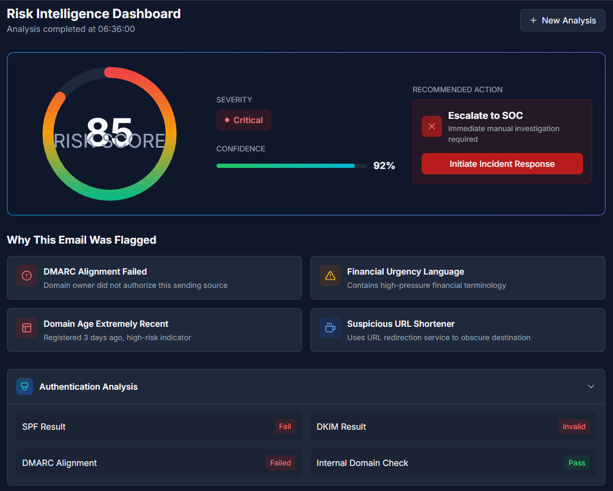

# PhishDetect — Enterprise Phishing Risk Intelligence Engine

PhishDetect is a modular, explainable phishing risk intelligence backend designed to assist SOC teams in prioritizing suspicious emails.  
Instead of binary “phishing / safe” classification, the system produces correlated risk intelligence with explainable indicators and confidence scoring.

Built for hackathon Phase-2 enterprise architecture.

---

## 🚀 Overview

Traditional email security tools focus heavily on signature detection and black-box machine learning. These approaches often struggle with:

- Business Email Compromise (BEC)
- Social engineering attacks
- Low-malware phishing campaigns
- Explainability for SOC teams

PhishDetect addresses these gaps by providing a **multi-signal correlated risk engine** that outputs structured phishing intelligence.

---

## 🎯 Key Capabilities

- Risk score (0–100)
- Severity classification
- Confidence estimation
- Explainable detection indicators
- Dataset-driven threat signals
- Modular detection architecture
- Stateless API design
- SOC/SOAR friendly output

---

## 🧠 Detection Philosophy

PhishDetect does **not** perform simple keyword matching or binary classification.

Instead, it:

- Correlates independent risk signals  
- Applies diversity-based confidence logic  
- Uses explainable rule-based detection  
- Supports threat-intelligence datasets  
- Treats AI as a supporting signal (not the final verdict)

---
```
## 🏗️ System Architecture
Email Input
↓
Orchestrator
↓
Detection Modules
├── Authentication Analysis
├── URL Intelligence
├── Intent & BEC Detection
└── Infrastructure Signals
↓
Correlation & Scoring Engine
↓
Risk Intelligence Output
```

---

## 📂 Project Structure

```
PhishDetect/

├── app.py
├── requirements.txt
├── README.md

├── core/
│   ├── orchestrator.py
│   └── scoring_engine.py

├── modules/
│   ├── authentication.py
│   ├── url_analysis.py
│   ├── intent.py
│   └── infrastructure.py

├── datasets/
│   ├── bec_intent_patterns.json
│   ├── suspicious_tlds.json
│   ├── risky_asn.json
│   ├── homograph_map.json
│   └── legit_domain_baseline.json

└── assets/
    └── dashboard_demo.png
```

## 🔍 Detection Modules

### Authentication Analysis
- SPF failure detection  
- DKIM validation checks  
- DMARC alignment signals  
- Organizational domain baseline checks  

### URL Intelligence
- Suspicious TLD detection  
- URL shortener detection  
- IP-based URL detection  
- Unicode homoglyph analysis  

### Intent & BEC Detection
- Financial fraud language  
- Credential harvesting intent  
- Urgency/coercion signals  
- Dataset-driven BEC patterns  

### Infrastructure Signals
- Risky ASN indicators  
- Hosting anomaly hints  

---

## 📊 Scoring Methodology

Final risk is calculated using **weighted multi-signal correlation**, not simple additive scoring.

Key factors:

- Signal impact weights  
- Cross-category diversity multiplier  
- Indicator volume  
- Confidence scaling  

This prevents single noisy signals from dominating the verdict.

---
## 📊 Dashboard Visualization


## 🧪 Example Output


```json
{
  "risk_score": 65,
  "severity": "High",
  "confidence": 75,
  "triggered_categories": [
    "authentication",
    "url",
    "intent"
  ],
  "indicators": [
    {
      "title": "SPF Authentication Failed",
      "category": "authentication",
      "impact": 20
    }
  ]
}


